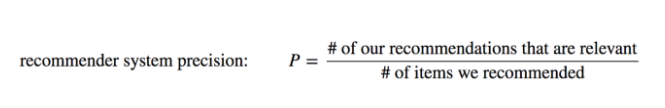

# Laporan Proyek Machine Learning - Ichwan Akmaluddin

## Project Overview
Pertumbuhan pada dunia film saat ini, menghasilkan banyak film dari berbagai daerah dan berbagai genre yang tersedia mulai dari film untuk anak sampa dengan kalangan dewasa. Menurut Fajriansyah dkk (2021), Dari sekian banyaknya film yang diproduksi  membuat  calon  penonton  kesulitan dalam menentukan film yang akan ditontonnya, sehingga akan memakan banyak waktu dan juga film yang ditentukan belum tentu sesuai dengan keinginan penonton dan membuat lebih banyak lagi memakan waktu bagi penonton. Dengan banyaknya film yang ada saat ini, sistem rekomendasi menjadi fitur yang penting guna membantu penonton menemukan film yang relevan dan mungkin disukai. Menurut Arfisko dan Wibowo (2022), Selain dari sudut pandang bisnis, sistem rekomendasi dapat membantu meningkatkan waktu aktfitas pengguna di dalam suatu platform dengan cara menampilkan item-item relevan kepada pengguna, yang mana nantinya seiring waktu dapat meningkatkan pendapatan untuk pelatform itu sendiri. Oleh karena itu, sistem rekomendasi menjadi sebuah fitur yang sangat penting untuk selalu ada pada platform penyedia film seperti ini.

## Business Understanding
### Problem Statements
1. Bagaimana merekomendasikan film berdasarkan kemiripan konten (genre dan tag)?
2. Bagaimana memprediksi preferensi pengguna untuk film yang belum ditonton?

### Goals
1. Membangun sistem content-based filtering menggunakan TF-IDF untuk mengubah fitur menjadi vektor numerik dan cosine similarity guna menghasilkan rekomendasi yang personal.
2. Mengembangkan collaborative filtering dengan neural network untuk prediksi rating yang akan menghasilkan rekomendasi yang sesuai. 

### Solution approach
Solusi yang saya buat yaitu dengan menggunakan 2 algoritma Machine Learning sistem rekomendasi,yaitu :
1. **Content Based Filtering**, algoritma yang merekomendasikan item serupa dengan apa yang disukai pengguna, berdasarkan tindakan mereka sebelumnya atau umpan balik eksplisit.
2. **Collaborative Filtering**, algoritma yang bergantung pada pendapat komunitas pengguna. Dia tidak memerlukan atribut untuk setiap itemnya.

Algoritma Content Based Filtering digunakan untuk merekemondesikan film berdasarkan aktivitas pengguna pada masa lalu, sedangkan algoritma Collabarative Filltering digunakan untuk merekomendasikan movie berdasarkan ratings yang paling tinggi.


## Data Understanding
Dataset yang digunakan pada projek Machine Learning ini menggunankan dataset dari Kaggle berikut, [Movie Recommendation Data](https://www.kaggle.com/datasets/rohan4050/movie-recommendation-data). Dalam dataset ini terdapat beberapa file .csv yang bisa digunakanan untuk melakukan rekomendasi terhadap film yang ada, diantaranya sebagai berikut. 

1. File ```movies.csv```, terdiri dari 9742 data dan 3 kolom dengan beberapa kolom sebagai berikut. (movies: daftar film yang tersedia)
    - movieId: id unik yang ada pada tiap film.
    - title: Judul dari film-film yang tersedia
    - genres: kategori yanga ada pada tiap film.
2. File ```ratings.csv```, terdiri dari 101 ribu data dan 4 kolom berbeda dengan variabel berikut. (ratings: penilaian dari pengguna)
    - userId: id unik yang dimiliki para penonton.
    - movieId: id unik yang ada pada tiap film.
    - rating: penilaian yang diberikan oleh penonton ke film yang mereka lihat.
    - timestamp: tanda waktu yang menandai kapan suatu peristiwa terjadi.
3. File ```tags.csv```, terdiri dari 3683 data dan 4 kolom dengan variabel berikut. (tags: kata kunci untuk film)
    - userId: id unik yang dimiliki para penonton.
    - movieId: id unik yang ada pada tiap film.
    - tag: daftar kata kunci untuk film
    - timestamp: tanda waktu yang menandai kapan suatu peristiwa terjadi.

Kemudian dari ketiga data terlihat tidak ditemukan missing value yang terlihat dari nilai output berikut:
```
Missing values movies:
movieId    0
title      0
genres     0
dtype: int64

Missing values ratings:
userId       0
movieId      0
rating       0
timestamp    0
dtype: int64

Missing values tags:
userId       0
movieId      0
tag          0
timestamp    0
dtype: int64
```
Untuk mengetahui data lebih lanjut kita akan melihat bagaimana data tersebut benar atau ada duplikan dengan code berikut:
```
print("Duplikat movies:", movies.duplicated().sum())
print("Duplikat ratings:", ratings.duplicated().sum())
print("Duplikat tags:", tags.duplicated().sum())
```
Output:
```
Duplikat movies: 0
Duplikat ratings: 0
Duplikat tags: 0
```
Dan terakhir kita bisa melihat data outlier dari pada nilai numerik, pada data ini hanya ada pada file ratings di kolom rating saja.


terlihat pada boxplot, data yang ditemukan pada rating masih sangat aman dengan range antara 0 sampai 5.

## Data Preparation
1. **Menggabungkan Genre dan Tag**
    ```
    movie_tags = tags.groupby('movieId')['tag'].apply(lambda x: '|'.join(x)).reset_index()
    movies = pd.merge(movies, movie_tags, on='movieId', how='left')
    ```
    Tahap ini bertujuan untuk menggabungkan semua ```tag``` untuk setiap film menjadi satu string yang dipisahkan oleh "|" dan digabungkan ke dalam dataframe movies berdasarkan ```movieId```.
2. **Membuat kolom baru tags**
    ```
    movies['tags'] = movies['tag'].fillna('') + ' ' + movies['genres'].str.replace('|', ' ')
    ```
    Membuat kolom baru yang bertujuan menyatukan antara tag dengan genre pada film.
3. **Membersihkan data**
    ```
    movies['tags'] = movies['tags'].str.strip()
    movies['tags'] = movies['tags'].fillna('')
    ```
    Data akan dibersihkan dengan menghapus spasi berlebih di awal/akhir string kemudian mengisi nilai kosong (NaN) dengan string kosong agar tidak error saat vektorisasi.
4. **Data Preparation untuk Content-Based**
    ```
    data = movies[['movieId', 'title', 'tags']]
    data = data.rename(columns={'movieId': 'id', 'title': 'movie_title'})
    ```
    Pada variabel ```data``` akan digunakan sebagai dataframe yang nantinya dibuat dalam permodelan Content-Based Filtering.
5. **Proses TF-IDF pada data**

    Pada proses CBF dilakukan proses melalui TF-IDF Vectorizer yang digunakan untuk menghasilkan matriks yang merepresentasikan film sebagai vektor yang selanjutnya akan dilanjutkan dengan cosine similarity pada modeling.
    ```
    tfidf_vectorizer = TfidfVectorizer(analyzer='word', ngram_range=(1, 2), min_df=1, stop_words='english')
    tfidf_matrix = tfidf_vectorizer.fit_transform(data['tags'])
    ```
6. **Melakukan encode, normalisasi dan mapping**

    Pada bagian ini dilakukan dengan tujuan dapat di proses. Data akan di encode agar mudah dilakuakan mapping dan normalisasi dilakukan seperti mengubah nilai menjadi range antara 0-1. Hal ini karena model menggunakan sigmoid dan loss BinaryCrossentropy(), yang mengharuskan label dalam range tersebut.
7. **Melakukan split data**

    Proses ini digunakan sebagai pembagian data antara training dan validation dengan besaran 80:20 seperti di bawah.
    ```
    train_indices = int(0.8 * len(x))
    x_train, x_val, y_train, y_val = (
        x[:train_indices],
        x[train_indices:],
        y[:train_indices],
        y[train_indices:]
    )
    ```


## Modeling
Sistem rekomendasi pada projek kali ini memiliki 2 permodelan dengan pendekatan Content-Based Filtering (CBF) dan dengan pendekatan Collaborative Filtering (CF).

- **Content-Based Filtering**

    Setelah preprosessing yang dilakukan di TF-IDF, dilakukan cosine similarity untuk melihat kemiripan antar vektor film yang mana semakin dekat maka akan dikatakan mirip. Kemudian dibuat index dengan code di bawah.
    ```
    cosine_sim = cosine_similarity(tfidf_matrix, tfidf_matrix)

    indices = pd.Series(data.index, index=data['movie_title']).drop_duplicates()
    ```
    Dengan ini dapat menghubungkan judul film ke posisi datan agar bisa dipakai dalam fungsi rekomendasi.

    Hasil:

    

    Hasilnya dilihat bahwa pencarian hasil toy story diberikan Top 5 rekomendasi sesuai dengan tag yang paling mirip dengan toy story.

    Kelebihan: Tidak membutuhkan data pengguna dan cocok untuk cold start user, ringan dan cepat digunakan.

    Kekurangan: Tidak memberi rekomendasi di luar konten yang mirip, dan terkadang terlalu umum, sehingga di sini juga tidak mempertimbangkan hasil dari feedback atau rating dari pengguna.

- **Collaborative Filtering**

    Pada memrosesan selanjutnya menggunakan CF, pada sistem rekomendasi ini mengandalkan interaksi yang ada antara pengguna dengan film yang ada sebagai acuan dalam memprediksi, dengan data interaksi seperti rating atau tag yang diberikan oleh pengguna.

    Hasil:

    

    Pada hasil di sini Top 10 rekomendasi yang diberikan secara beragam sesuai dengan kesukaan dari penonton yang telah memberi rating dengan nilai tertinggi kemudina dimunculkan beberapa rekomendasi.

    Kelebihan: Dapat mempelajari dari pola preferensi tanpa perlu fitur seperti genre dan tag, sigatnya lebih fleksibel dan scalable.

    Kekurangan: membutuhkan jumlah interaksi berupa rating agar hasilnya akurat sehingga tidak bisa merekomendasikan untuk user cold start.

## Evaluation
1. Hasil evaluasi untuk pendekatan Content-Based Filtering

    

    Dari hasil pengujian di sini dapat terlihat untuk genre/tag yang ada pada Toy Story (1995), yaitu  Adventure Animation Children, mendapatkan hasil rekomendasi dengan hasil yang serupa pada film Bug's Life (1998), Antz (1998)	Adventures of Rocky and Bullwinkle (2000), Emperor's New Groove (2000) dan Monsters, Inc. (2001). Pada rekomendasi yang dihasilkan dengan pendekatan ini dengan k=5 menghasilkan tags yang mirip dengan yang dicari sebanyak 5 rekomendasi selain dari film itu sendiri.

    Kemudian dihitung menggunakan metrik **Precision@k** dari 5 item untuk rekomendasi dari *Toy Story (1995)* dengen tag Adventure, Animation, Children dan Comedy dihasilkan Top 5 dengan tags/genre yang serupa, sehingga dihitung dengan rumus di bawah.

    

    Hasilnya, **Precision@5 = 5/5 = 1.0 (100%)**

    Artinya seluruh output rekomendasi mirip dan relevan dengan input yang diberikan.


2. Hasil evaluasi untuk pendekatan Collaboration Filtering

    Untuk model ini dievaluasi menggunakan metrik Root Mean Squared Error (RMSE) yang mana akan mengukur seberapa besar selisis antara rating sebenarnya dengan yang diprediksi, sebagai acuan maka nilai dari RMSE yang lebih kecil atau mendekati nol maka nilai itu semakin baik.
    ```
    model.compile(
        loss=tf.keras.losses.BinaryCrossentropy(),
        optimizer=tf.keras.optimizers.Adam(learning_rate=0.001),
        metrics=[tf.keras.metrics.RootMeanSquaredError()]
    )
    ```
    Model ini menggunakan aktivasi sigmoid, sehingga rating akan dinormalisasi dahulu ke range 0 sampai 1 dengan fungsi loss BinaryCrossentropy().

    

    Hasil dari training selama 20 epoch memperlihatkan performa yang terus membaik, artinya model belajar dengan bagus dari training dan validasi dengan hasil akhir **RMSE 0,1957** dan **validation di 0,2409**.

    

    Dilihat dari grafik  selama training terlihat bahwa nilai RMSE pada training dan validasi menurun secara konsisten, walaupun ada gap yang membuat selisih kedua nilai, namun gap ini masih dalam batas wajar.

**---Ini adalah bagian akhir laporan---**

## Daftar Pustaka
1. Fajriansyah, M., Adikara, P. P., & Widodo, A. W. (2021). Sistem Rekomendasi Film Menggunakan Content Based Filtering. Jurnal Pengembangan Teknologi Informasi dan Ilmu Komputer, 5(6), 2188-2199.
2. Arfisko, H. H., & Wibowo, A. T. (2022). Sistem Rekomendasi Film Menggunakan Metode Hybrid Collaborative Filtering Dan Content-Based Filtering. eProceedings of Engineering, 9(3).